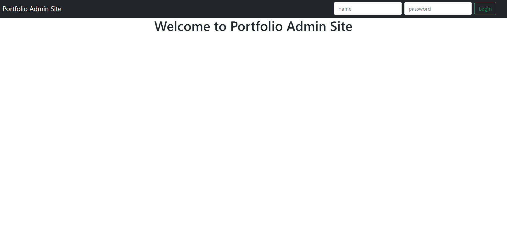

# Protfolio Admin Site
Site created to fullfill my portfolio site. 
Site allows me to see all the messages sent through contact form on my portfolio site.
Site was build following OOP approach. 

## How to run?

1. Fork or download repo.
2. Run command `npm install` to install dependencies.
3. To run server run command `parcel index.html`.
4. Go to http://localhost:1234/ .
5. Enjoy!

## Technology
- JavaScript
- Parcel
- Bootstrap 
- Axios

## How does the site looks like?

